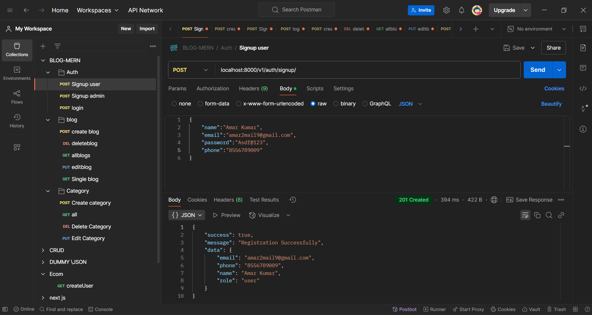
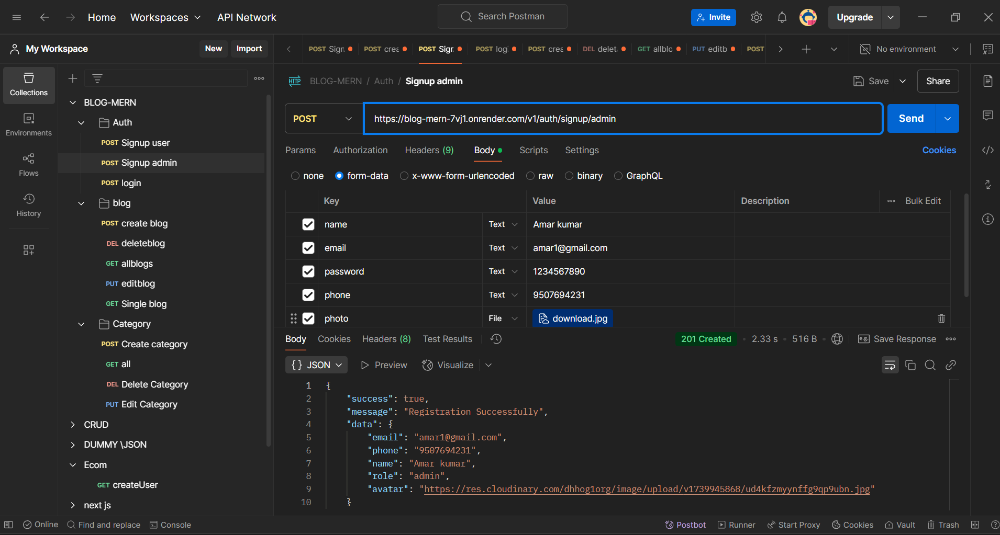
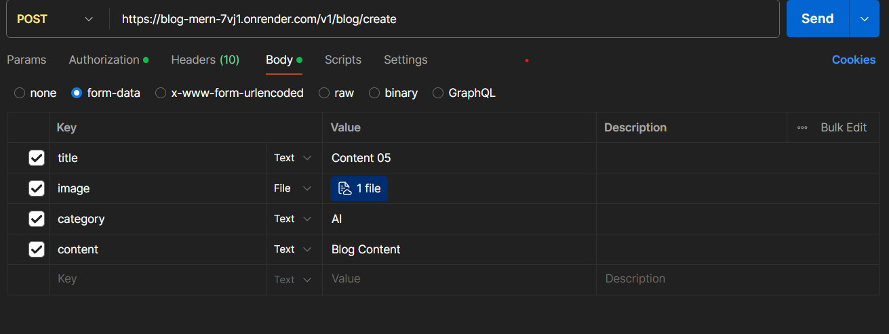

<!-- Admin and user signUp and sign in completed -->

# Blog_Mern

<h2>User Sign Up METHOD (POST) </h2>

```
https://blog-mern-7vj1.onrender.com/v1/auth/signup/
```



<!-- Admin SignUp -->
<h2 >Admin SignUp METHOD (POST)</h2>

```
https://blog-mern-7vj1.onrender.com/v1/auth/signup/admin
```



<!-- login routes -->
<h2>Login Routes METHOD (POST)</h2>

```
https://blog-mern-7vj1.onrender.com/v1/auth/signup
```

<h2>Create Blog Routes METHOD (POST)</h2>

```
https://blog-mern-7vj1.onrender.com/v1/blog/create
```



<h2>Fetch All blog METHOD (GET)</h2>

```
https://blog-mern-7vj1.onrender.com/v1/blogs
```

<h2>Fetch Single blog by blog id method (GET)</h2>

```js
const blogId ;
https://blog-mern-7vj1.onrender.com/v1/blog/${blogId}
```

<h2>Delete  blog by blog id Method (DELETE)</h2>

```js
const blogId ;
https://blog-mern-7vj1.onrender.com/v1/blog/${blogId}
```

<h2>EDIT  blog by blog id Method (PUT)</h2>

```js
const blogId ;
https://blog-mern-7vj1.onrender.com/v1/blog/${blogId}
```

```js
{
    "title":"Category Name",
    "content":"Required otherwise take prev",
    "category":"Optional other wise UNCATEGORIZED"
}
```

<hr/>
<h1>Category CRUD</h1>
<h2>Get all Category Method (GET)</h2>

```
https://blog-mern-7vj1.onrender.com/v1/categories
```

<h2>Get Single Category by Category ID Method (GET)</h2>

```
https://blog-mern-7vj1.onrender.com/v1/category/categoryId
```

<h2>Delete  Category by category id Method (DELETE)</h2>

```
https://blog-mern-7vj1.onrender.com/v1/category/id
```

<h2>EDit  Category by category id ID Method (PUT)</h2>

```
https://blog-mern-7vj1.onrender.com/v1/category
```

```js
{
    "title":"Category Name",
    "description":"Optional"
}
```

<h2>Crate Category  ID Method (POST)</h2>

```
https://blog-mern-7vj1.onrender.com/v1/category/new
```

```js
{
    "title":"Category Name",
    "description":"Optional"
}
```
